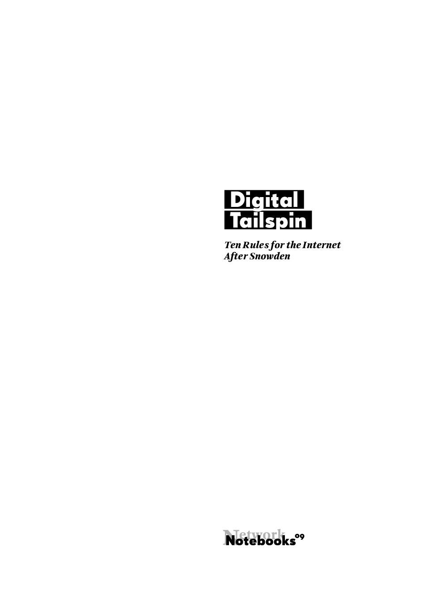

#Title Page

# Digital Tailspin
<!-- backcover text -->
Privacy, copyright, classified documents and state secrets, but also
spontaneous network phenomena like flash mobs and hashtag
revolutions, reveal one thing – we lost control over the digital world.
We experience a digital tailspin, or as Michael Seemann calls it in this essay: a loss of control or *Kontrollverlust*. Data we never knew existed is finding paths that were not intended and reveals information
  that we would never have thought of on our own.

Traditional institutions and concepts of freedom are threatened by this
digital tailspin. But that doesn’t mean we are lost. A new game emerges,
where a different set of rules applies. To take part, we need to embrace
a new way of thinking and a radical new ethics – we need to search for
freedom in completely different places. While the Old Game depended upon
top-down hierarchies and a trust in the protective power of state
justice systems, the New Game asks you to let go of all these
certainties. Strategies to play the game of digital tailspin rely on
flexibility, openness, transparency and what is dubbed ‘antifragility’.
In *The New Game: 10 Rules for the Digital Tailspin* Michael Seemann
  examines which strategies are most appropriate in the New Game and why.

Michael Seemann studied Applied Cultural Studies in Lüneburg. Since 2005
he is active on the internet with various projects. He founded
[twitkrit.de](http://twitkrit.de/)
and [Twitterlesung.de](http://twitterlesung.de/) (‘reading Twitter’),
organized various events and runs the popular podcast
[wir.muessenreden.de](http://wir.muessenreden.de/). In 2010 he began
the blog CTRL-verlust, about the loss of control over data on the
internet. In 2014 he published *Das neue Spiel* after a successful
crowdfunding campaign. Now he blogs at [mspr0.de](http://mspr0.de/)
and writes for various media like Rolling Stone, TIME online, SPEX,
Spiegel Online, c't and the DU magazine. He gives lectures on
whistleblowing, privacy, copyright, internet culture and the crisis of
  institutions in times of *Kontrollverlust*.

